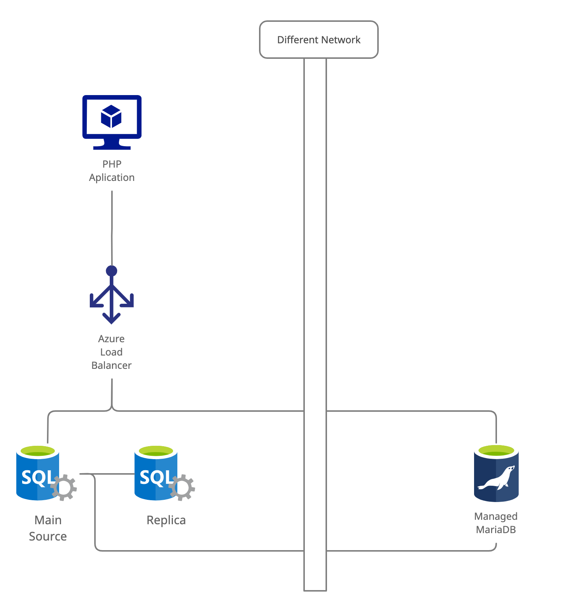

# Current architecture

The backend application connects to a load balancer. The load balancer has two probes.

Each probe points to a MariaDB database replicated using Galera [fig1].

# Proposed migration plan

Include the managed MariaDB database into the load balancing pool.

The reason behind this decision is to mitigate any downtime or data loss during the first replication period. [fig2]

# After migration steps and cleanup

Once all servers are in sync, update the backend application to use connect to the managed MariaDB server.

When the application deployment is finished, break the replication between the older servers and managed one.

Decommissioned the old environment and 🥳 [fig3]

